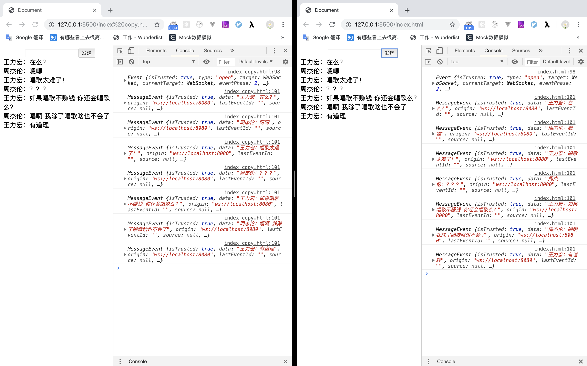

# websocket




简单的群聊 websocket demo

服务端使用ws包而没有使用socket.io 

原因是ws兼容性更好

###  WebSocket 是什么？

1. 建立在 TCP 协议之上的网络通信协议
2. 全双工通信协议
3. 没有同源限制
4. 可以发送文本、二进制数据等

###  为什么需要 WebSocket？

了解计算机网络协议的人，应该都知道：HTTP 协议是一种无状态的、无连接的、单向的应用层协议。它采用了请求/响应模型。通信请求只能由客户端发起，服务端对请求做出应答处理。

这种通信模型有一个弊端：HTTP 协议无法实现服务器主动向客户端发起消息。

因此，如果在客户端想实时监听服务器变化，必须使用 ajax 来进行轮询，效率低，浪费资源。

而 websocket 就可以使得**前后端进行全双工通信（两方都可以向对方进行数据推送），是真正的平等对话**


**服务端代码**

```js
const port = 8080
const ws = require('ws');
const wss = new ws.Server({ port });
/**
 * 向除了本身之外所有客户端发送消息，实现群聊功能
 * @param {*} data 要发送的数据
 * @param {*} ws 客户端连接对象
 */
wss.broadcastToElse = function broadcast(data, ws) {
    wss.clients.forEach(function each(client) {
        if (client !== ws && client.readyState === ws.OPEN) {
            client.send(data);
        }
    });
};

/* 客户端接入，触发 connection */
wss.on("connection", function connection(ws, req) {
    let ip = req.connection.remoteAddress; // 通过req对象可以获得客户端信息，比如：ip，headers等

    /* 客户端发送消息，触发 message */
    ws.on("message", function incoming(message) {
        ws.send(message); // 向客户端发送消息
        wss.broadcastToElse(message, ws); // 向 其他的 客户端发送消息，实现群聊效果
    });
});
```

**客户端代码**

```html
<!DOCTYPE html>
<html lang="en">

<head>
    <meta charset="UTF-8">
    <meta name="viewport" content="width=device-width, initial-scale=1.0">
    <meta http-equiv="X-UA-Compatible" content="ie=edge">
    <title>Document</title>
</head>
<style>
    html,
    body {
        height: 100%;
        width: 100%;

    }

    .send-box {
        display: flex;
        justify-content: center;
        align-items: center;
    }
</style>

<body>
    <div class="send-box">
        <input type="text" class="val">
        <button class="btn">发送</button>
    </div>
</body>
<script>

    const btn = document.querySelector('.btn');
    const val = document.querySelector('.val');
    btn.addEventListener('click', (e) => {
        const mssage = val.value;
        val.value = '';
        ws.send(`周杰伦：${mssage}`)
    })

    const ws = new WebSocket('ws://localhost:8080/');
    ws.onopen = e => {
        console.log(e);
    }
    ws.onmessage = e => {
        console.log(e);
        const message_dom = document.createDocumentFragment();
        const div = document.createElement('div');
        div.innerHTML = e.data;
        message_dom.appendChild(div);
        document.body.appendChild(message_dom);
    }
    ws.onclose = e => {
        console.log(e);
    }
    ws.onerror = e => {
        console.log(e);
    }


</script>

</html>
```


